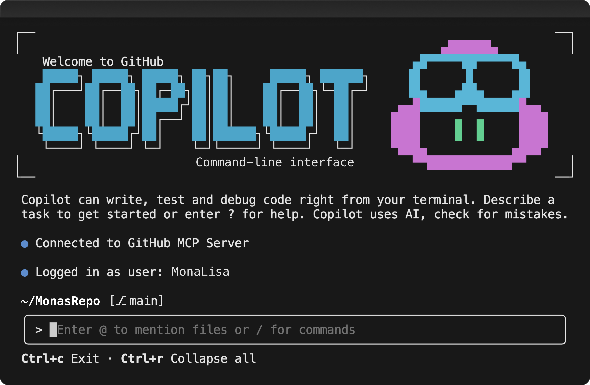

<a name="start-building"></a>
<br>
<p align="center">

</p>

# [Microsoft Build 2026](https://build.microsoft.com)

## 🔥 BRK203: From CLI to PR: Automating the path to merged code



### Session Description

Everyone talks about agents, but the real challenge is applying them to daily sprints. Moving beyond chat, we'll show how GitHub Copilot functions as an agentic partner in your workflow by live-coding[...]

### 🏠 Getting started on your own

Ready to start using GitHub Copilot CLI? [Install today](https://docs.github.com/en/copilot/how-tos/copilot-cli/cli-getting-started#installation)

### 🧠 Goals

- Teach a repeatable workflow for going from idea → PR → merged code using agents​
- Show how to increase success rate of one-shot implementations​
- Demonstrate how to build verification loops that make agents reliable

### 💬 Keep Learning with Copilot

Try these prompts with GitHub Copilot to explore the topics from this session. Open Copilot Chat in VS Code (`Ctrl+Alt+I` on Windows/Linux, `Cmd+Shift+I` on Mac), paste a prompt, and see what you lear[...]

Use these as a starting point — or write your own!

<!-- Prompts will be tailored to this session's content during repo setup. -->

- *How do I get started with GitHub Copilot CLI?*
- *What are best practices for Copilot CLI?*
- *How can you use multiple models at once?*
- *How does the Copilot CLI harness work under the hood?*

### 📚 Resources and Next Steps

| Resource | Description |
|:---------|:------------|
| [GitHub Copilot CLI web page](https://github.com/features/copilot/cli) | Check out our website|
| [GitHub Copilot CLI best practices](https://docs.github.com/en/copilot/how-tos/copilot-cli/cli-best-practices) | Learn to get the most out of Copilot CLI|
| [GitHub Copilot CLI changelog](https://github.com/github/copilot-cli/releases)|Copilot CLI specific changelog with all the releases|
| [GitHub Copilot CLI beginner tutorial](https://github.com/github/copilot-cli-for-beginners) | Repo tutorial course for beginners|
| [GitHub Copilot CLI beginner videos](https://www.youtube.com/playlist?list=PL0lo9MOBetEHvO-spzKBAITkkTqv4RvNl)| Video format tutorial course for beginners|


### 🌟 Microsoft Learn MCP Server

The Microsoft Learn MCP Server gives your AI agent direct access to Microsoft's official documentation — grounded, up-to-date answers about the products and services covered in this session.

**VS Code** — One click installation: 

[](https://vscode.dev/redirect/mcp/install?name=mi[...]


**GitHub Copilot CLI** — Run this to install the Learn MCP Server as a plugin:
```
/plugin install microsoftdocs/mcp
```

For more info, other clients, and to post questions, visit the [Learn MCP Server repo](https://aka.ms/learnmcp).

## Content Owners

<!-- TODO: Add yourself as a content owner
1. Change the src in the image tag to {your github url}.png
2. Change INSERT NAME HERE to your name
3. Change the github url in the final href to your url. -->

<table>
<tr>
    <td align="center"><a href="http://github.com/cassidoo">
        <br />
        <sub><b>Cassidy Williams</b></sub></a><br />
            <a href="https://github.com/cassidoo" title="Senior Director, Developer Advocacy">📢</a>
    </td>
    <td align="center"><a href="http://github.com/evanboyle">
        <br />
        <sub><b>Evan Boyle</b></sub></a><br />
            <a href="https://github.com/evanboyle" title="Principal Manager, Software Engineering">📢</a>
    </td>
</tr>
</table>

## Contributing

This project welcomes contributions and suggestions.  Most contributions require you to agree to a
Contributor License Agreement (CLA) declaring that you have the right to, and actually do, grant us
the rights to use your contribution. For details, visit [Contributor License Agreements](https://cla.opensource.microsoft.com).

When you submit a pull request, a CLA bot will automatically determine whether you need to provide
a CLA and decorate the PR appropriately (e.g., status check, comment). Simply follow the instructions
provided by the bot. You will only need to do this once across all repos using our CLA.

This project has adopted the [Microsoft Open Source Code of Conduct](https://opensource.microsoft.com/codeofconduct/).
For more information see the [Code of Conduct FAQ](https://opensource.microsoft.com/codeofconduct/faq/) or
contact [opencode@microsoft.com](mailto:opencode@microsoft.com) with any additional questions or comments.

## Trademarks

This project may contain trademarks or logos for projects, products, or services. Authorized use of Microsoft
trademarks or logos is subject to and must follow
[Microsoft's Trademark & Brand Guidelines](https://www.microsoft.com/legal/intellectualproperty/trademarks/usage/general).
Use of Microsoft trademarks or logos in modified versions of this project must not cause confusion or imply Microsoft sponsorship.
Any use of third-party trademarks or logos are subject to those third-party's policies.
